# VerifyAI

# Autonomous Scientific Auditing & Intelligence Platform

VerifyAI is an AI-powered multi-agent platform that audits research papers, repositories, reproducibility claims, and scientific transparency signals using autonomous reasoning agents and repository intelligence workflows.

The system combines paper analysis, repository inspection, plausibility verification, reviewer simulation, and scientific trust scoring into a unified scientific auditing platform.

---

# 🚀 Features

- 📄 AI-powered research paper analysis
- 📂 Real GitHub repository intelligence scanning
- 📊 Scientific plausibility verification
- 👨‍⚖️ Multi-reviewer peer review simulation
- 🏁 Dynamic scientific trust scoring
- 🔍 Reproducibility assessment
- ⚙️ Multi-agent orchestration workflow
- 🌐 Community trust signal analysis
- 📑 Benchmark and methodology extraction
- 🧬 Architecture consistency validation
- 📈 Workflow visualization dashboard
- 🎨 Futuristic scientific UI

---

# 🧠 Multi-Agent Architecture

## 📄 Paper Analysis Agent
- Extracts methodology
- Detects benchmarks
- Identifies datasets
- Parses architecture claims
- Understands experimental setup

## 📂 Repository Intelligence Agent
- Scans GitHub repositories
- Detects reproducibility artifacts
- Validates repository structure
- Checks training/evaluation scripts
- Extracts community trust metrics

## 📊 Plausibility Verification Agent
- Validates benchmark realism
- Cross-checks architecture consistency
- Analyzes compute feasibility
- Evaluates scientific claims

## 👨‍⚖️ Reviewer Simulation Agent
Simulates:
- Academic Reviewer
- Open Source Maintainer
- Industry Engineering Lead
- Ethics & Bias Reviewer
- Reproducibility Reviewer

## 🏁 Scientific Trust Agent
Generates:
- Scientific credibility score
- Methodology quality score
- Transparency score
- Reproducibility confidence

---

# 🛠️ Tech Stack

- Python
- Streamlit
- Gemini API
- Google AI Studio
- GitHub API
- HTML
- CSS
- JavaScript
- SQL
- JSON
- Markdown

---

# 📂 Project Structure

```text
VerifyAI/
│
├── app.py
├── requirements.txt
├── README.md
├── LICENSE
├── .gitignore
│
├── agents/
├── utils/
├── styles/
├── assets/
└── data/
```

---

# ⚙️ Installation

## Clone Repository

```bash
git clone https://github.com/your-username/VerifyAI.git
cd VerifyAI
```

## Install Dependencies

```bash
pip install -r requirements.txt
```

## Run Application

```bash
streamlit run app.py
```

---

# 🔬 Scientific Audit Capabilities

VerifyAI can analyze:

- Model architecture claims
- Benchmark transparency
- Reproducibility evidence
- Training pipeline visibility
- Configuration completeness
- Repository maturity
- Open-source engineering quality
- Scientific plausibility

---

# 📊 Repository Intelligence

The platform performs:
- Branch inspection
- File structure analysis
- Dependency detection
- Docker/config detection
- Training script detection
- Evaluation pipeline detection
- Checkpoint validation
- Community metric extraction

---

# 🌐 Community Trust Signals

VerifyAI evaluates:
- GitHub stars
- Forks
- Contributors
- Repository activity
- Documentation quality
- CI/CD presence
- Open-source maturity

---

# 🎯 Inspiration

Modern AI research is evolving rapidly, but reproducibility, transparency, and scientific validation remain major challenges.

VerifyAI was built to help researchers, reviewers, students, and engineers quickly evaluate the credibility and reproducibility of AI research artifacts using autonomous AI agents and repository intelligence.

---

# ⚡ Challenges Faced

- Designing reliable multi-agent orchestration
- Building grounded scientific reasoning workflows
- Integrating repository intelligence pipelines
- Preventing generic LLM outputs
- Creating believable reviewer simulations
- Designing a futuristic scientific UI
- Balancing transparency with practical feasibility

---

# 📚 What We Learned

- Multi-agent systems design
- Scientific reasoning workflows
- Repository analysis pipelines
- Prompt engineering for grounded outputs
- AI-assisted reproducibility analysis
- Interactive dashboard design
- Research artifact auditing methodologies

---

# 🔮 Future Improvements

- Full MCP protocol integration
- Live repository execution sandboxes
- Dataset availability validation
- Citation graph analysis
- Research fraud detection
- Benchmark reproducibility testing
- Cross-paper scientific consistency analysis

---

# 📸 Screenshots

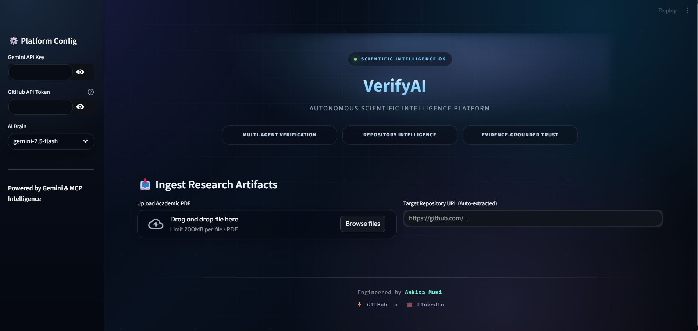
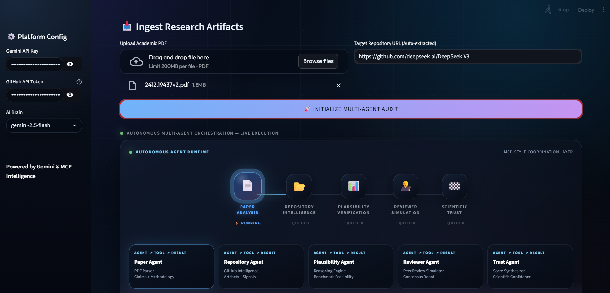
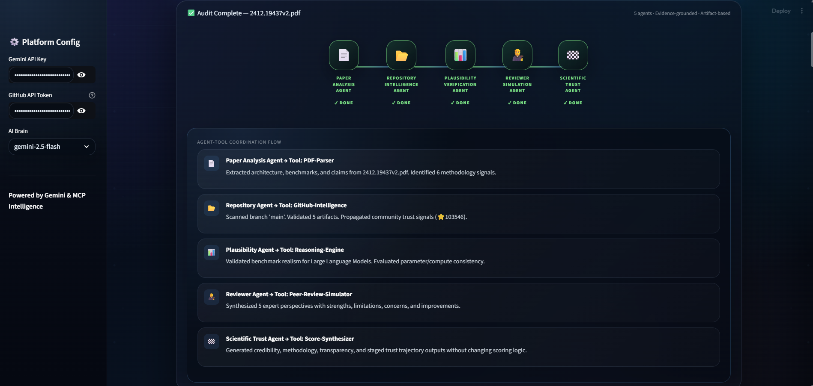
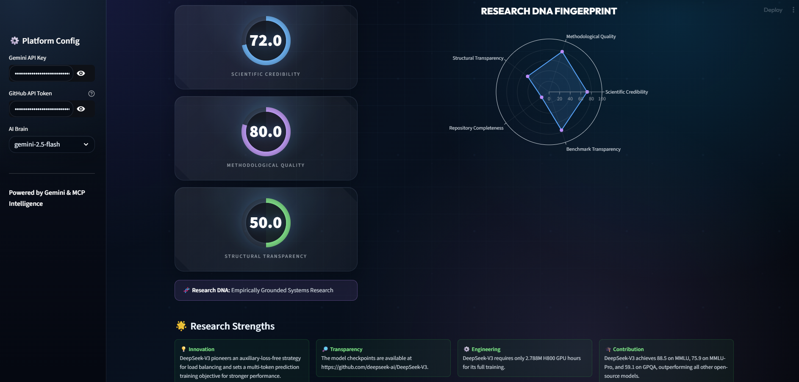
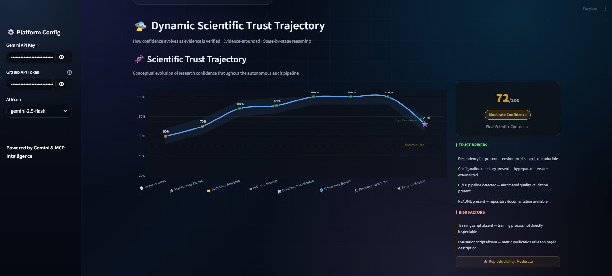
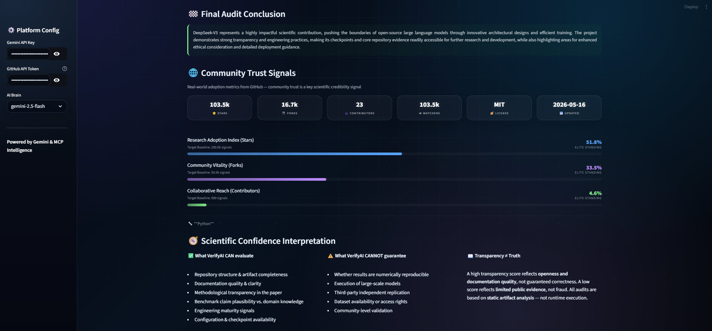
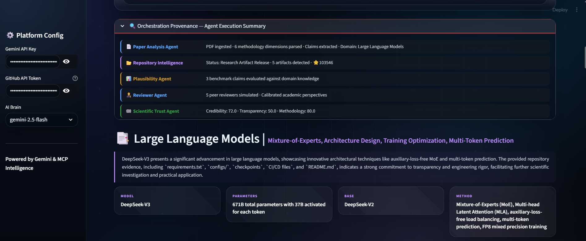
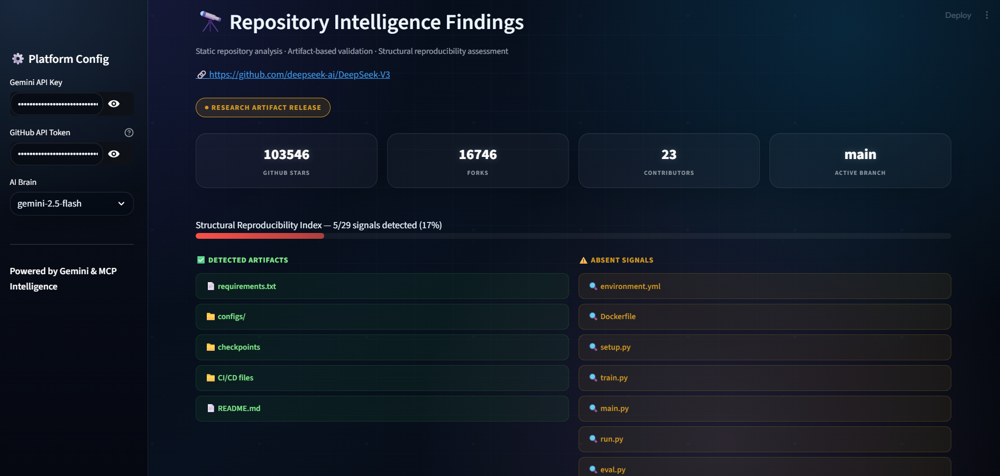

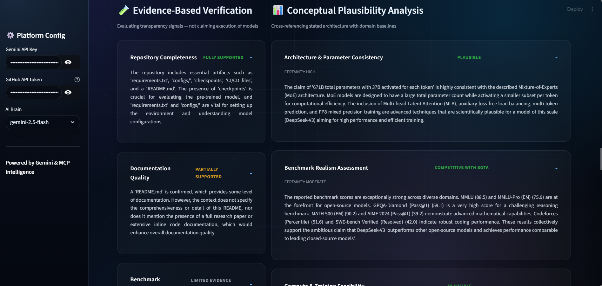
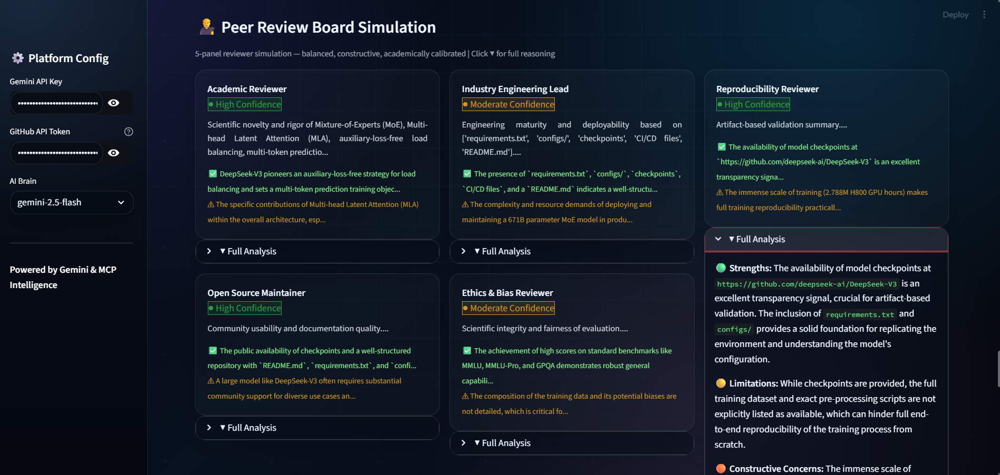
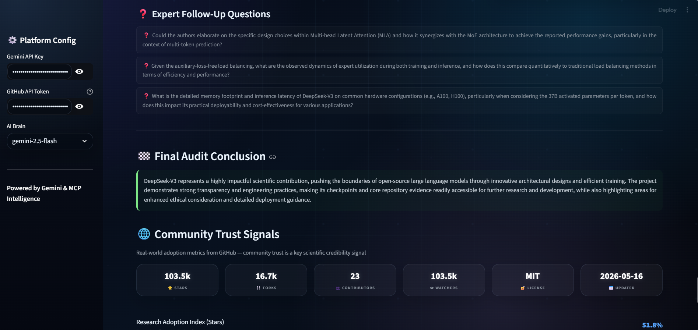

---

# ⚠️ Disclaimer

VerifyAI performs evidence-grounded static analysis and reasoning-based scientific auditing.

The platform does NOT guarantee:
- Numerical reproducibility
- Runtime execution correctness
- Third-party validation
- Experimental replication

Transparency does not necessarily imply correctness.

---

# 👩‍💻 Developed For

Hackathons, scientific reproducibility research, AI auditing, and autonomous research intelligence systems.

---

# 📜 License

MIT License

---

# ⭐ VerifyAI

Autonomous Scientific Auditing & Intelligence Platform  
Built for the future of trustworthy AI research.
